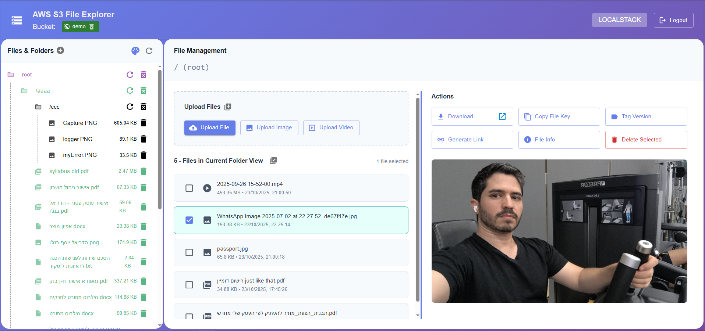

# AWS S3 File Explorer Project

A comprehensive fullstack S3 file explorer built in two weeks, designed to showcase and test my perfect package: `@hdriel/aws-utils`

[](https://nodei.co/npm/@hdriel/aws-utils/)

## 🎯 Project Overview

This project serves dual purposes:
1. **Impressive Fullstack Application** - A complete S3 file management system
2. **Package Demonstration** - Showcases the AWS SDK v3 service wrapper that simplifies interactions with S3 (and future AWS components)

## ✨ Key Features

The [@hdriel/aws-utils](https://www.npmjs.com/package/@hdriel/aws-utils) npm package provides powerful capabilities:
- **C.R.U.D** - S3 File Management
- **Upload** - Easy files uploads
- **Download** - Stream files directly to your device
- **Streaming** - Optimized video streaming with chunked delivery
- **Pagination** - Efficient loading for large buckets with thousands of files by infinity scrolling

> **Note**: The entire project is built using the [mui-simple](https://github.com/hdriel/mui-simple) component library that I created, providing a clean and consistent UI throughout the application. You can see how to add it to your projects and use it in this project: [vite-mui-simple](https://github.com/hdriel/vite-mui-simple)


### Installation

```bash
  npm install @hdriel/aws-utils
```

This project demonstrates simple and elegant usage of the package, allowing you to:
- Create folders and upload files
- View and load files from private buckets
- Generate public access links
- And much more!

---

## 🐳 LocalStack Support

The project is tested and validated against **LocalStack** - a Docker image that emulates AWS services locally, including:
- S3
- Lambda [TBD]
- SQS [TBD]
- SNS [TBD]
- And more

### Running with LocalStack

1. **Install Docker Desktop** on your machine
2. **Start LocalStack** using the included docker-compose:

```bash
   npm run docker:localstack
```

OR run this command to run also server & client images:

```bash
   npm run docker
```

then open the browser on: `http://localhost`

### Using Real AWS Credentials

You can connect with your official AWS credentials to access your actual buckets.

⚠️ **Warning**: The application includes delete operations. Exercise caution to avoid accidentally deleting important data from your real AWS account.

---

## 🚀 Running the Project

### Option 1: Full Docker Setup

Run everything through Docker via:

```bash
  npm run docker
```


### Option 2: Local Development

**Start the localstack docker instance only:**
```bash
   npm run docker:localstack
```

**Start the server:**
```bash
  npm run server
```

**Start the client:**
```bash
  npm run client
```

**Access the application:**
```
http://localhost:5173
```

## 📖 Application Guide

### Login Screen

You'll need to provide:
1. **AWS Credentials** (3 fields) - Usually found at:
```
C:\Users\<YOUR-USERNAME>\.aws\credentials
```

2. **Bucket Name** with public/private access setting (global checkbox)

- If the bucket doesn't exist, it will be created with your specified permissions
- If it exists, the application will connect with its existing permissions

When you check the **LocalStack** option:
- You'll see a list of buckets from your local LocalStack instance
- You can create a new bucket or use an existing one
- Credentials fields lock on default LocalStack instance credentials


### Main Screen

The main interface is divided into three sections:

#### Top Bar
- Displays bucket name and access level (public/private)
- Small delete button for bucket removal (only enabled for LocalStack, disabled for real AWS accounts)
- LocalStack indicator badge when connected to LocalStack
- Logout button on the right to switch buckets/credentials


#### Left Panel: File Tree
- Add new folders
- View list of folders and files in your bucket/directory
- Navigate through your bucket structure
- **Smart Pagination** - Loads folders and files progressively as you scroll through large directory structures

#### Right Panel: File Management

When you select a folder/file from the tree, you'll see:

1. **Full Path Navigation** - Complete breadcrumb to current directory

2. **Upload Section**
   - Dedicated buttons for image/video/file uploads
   - "Double plus" button for uploading multiple files simultaneously

3. **File List Section**
   - Select single or multiple files
   - Available actions adapt based on selection
   - **Lazy Loading** - Automatically loads more files as you scroll, perfect for directories with thousands of files

4. **Actions Section**
   - **Download to Computer** - Streams files directly (creates a unified ZIP for multiple files)
   - **Download via Public Link** - Opens a public URL for download
   - **Copy File Key URL** - accessible link for public bucket or public sign url
   - **Version Tagging** - Add version tags (e.g., 1.0.0) to files
   - **Generate Public Link** - Create public access links for files in private buckets
   - **Delete File** - Remove selected files

5. **Preview Section**
   When you select a single file:
   - **Image Preview** - View images directly with network request caching and optimization
   - **Video Streaming** - Optimized video playback with chunked delivery for smooth streaming
   - **PDF Viewer** - Inline PDF display with full document navigation
   - **Secure Private Preview** - View all content directly without requiring external public links

   This is one of the most impressive features of the application!

6. **Smart Pagination**
   - **Lazy Loading** - Files and folders load progressively as you scroll
   - **Large Bucket Support** - Handles buckets with thousands of files efficiently
   - **Tree View Pagination** - Navigate through extensive folder structures without performance issues
   - **File List Pagination** - Browse large directories seamlessly with automatic loading




### Resizable Panels

All panels are resizable! You can adjust:
- Tree files ↔ File management
- Upload files ↔ File list ↔ Actions

### 📱 Responsive Design

The project supports adaptive display for all screen sizes, including mobile devices!

Significant thought went into creating comfortable viewing experiences:
- Large screens: Actions panel can display to the right or below the file list
- Small screens: Options adapt automatically for optimal viewing
- Many other responsive design considerations


## 💻 Code Reference

Feel free to explore the project code to see how to implement these capabilities in your own projects using the `@hdriel/aws-utils` package.

## 🤝 Feedback & Contributions

I'd love to hear from you! If you encounter any issues or have additional ideas, please open an issue in this repository.

## 📄 License

The MIT License (MIT)

## 👤 Author

[Hadriel Benjo](https://github.com/hdriel)

---

**Built with ❤️ to demonstrate the power and simplicity of my package: `@hdriel/aws-utils`**